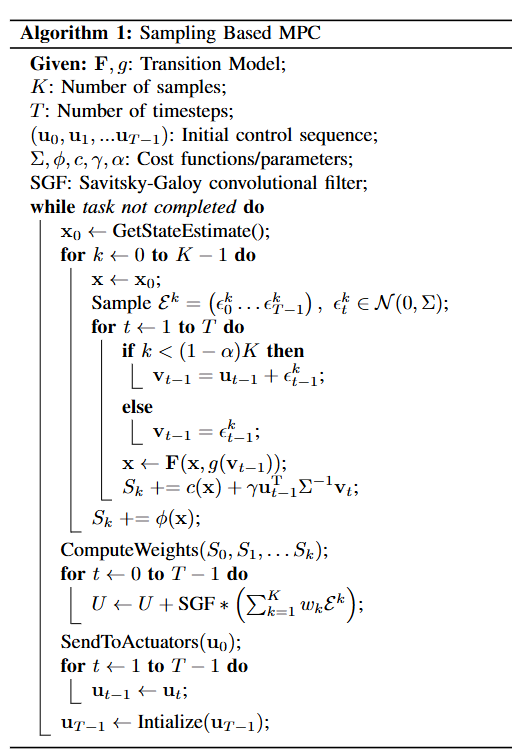

# EE 7500 Notes

This markdown keeps all my notes for the RoSE 25 paper which is the final project for EE 7500 MPC class.


## TODOS

- [x] Carefully finish the forward kinematics explanation from Dr. Haber and go through all the 13.3 chaper tutorials from here: https://modernrobotics.northwestern.edu/nu-gm-book-resource/13-3-1-modeling-of-nonholonomic-wheeled-mobile-robots/
- [x] Find a detailed resource to properly understand the differential drive model. Use [6], [7] or [8] to indicate parameters but be uniform
- [x] Create a DiffDrive vehicle kinematic model. Note down where Numba based acceleration may be possible.
- [x] Test DiffDrive model with MPPI on path (1) and save video
- [x] Put slides togerther and then if time permits try another path

**Before submitting report**

- [x] Create a notebook to visualize a different reference path. We showcase at least two paths
- [x] Test DiffDrive+MPPi on a path 2 (s-curve) and save video
- [x] Generate ATE error metric and plots
- [ ] Finish report
- [ ] Submit report

## For writing report / slide presentation

* Easy intro section writeup: https://sites.gatech.edu/acds/mppi/
* Review this to quickly explain how MPPI works: https://www.youtube.com/watch?v=19QLyMuQ_BE&t=1s&ab_channel=NeuromorphicWorkshopTelluride

## Paper references

* [1] Aggressive Driving with Model Predictive Path Integral Control by Grady Williams
* [2] MPOPI paper: https://ieeexplore.ieee.org/document/10160929
* [3] MPPI-Generic paper
* [3a] Biased-MPPI: Informing Sampling-based Model Predictive Control by Fusing Ancillary Controllers
* [4] A Multi-step Dynamics Modeling Framework For Autonomous Driving In Multiple Environments: Required to talk as an example of why I chose MPPI-Generic to package as ROS 2 package
* [5] https://ieeexplore.ieee.org/document/10665978 an example of uav simulators and potential future work
* [6] Modelling and Control of a Skid-Steering Mobile Robot for Indoor Trajectory Tracking Application (Master's Thesis)
* [7] Alexander Haber, "Detailed and correct derivation of kinematics equation of differential drive robot", url: https://www.youtube.com/watch?v=YxuJFQZh94Q&t=31s
* [8] Siegwart and Nourbakhs, "Chapter 3 Mobile Robot Kinematics", url: https://www.cs.cmu.edu/~rasc/Download/AMRobots3.pdf
* [9] Wikipedia, "diff_drive_controller", url: http://wiki.ros.org/diff_drive_controller
* [10] Frank Dellaert and Seth Huchinson, "5.2 Motion Model for the Differential Drive Robot"
* [11] Matthew Elwin, "Kinematics for Wheeled Mobile Robots: A practical approach": https://nu-msr.github.io/navigation_site/lectures/derive_kinematics.html
* [12] Buchloz, "MPPI in C++": url: https://markus-x-buchholz.medium.com/model-predictive-path-integral-mppi-control-in-c-b13ea594ca20
* [13] https://control.ros.org/rolling/doc/ros2_controllers/doc/mobile_robot_kinematics.html

Some papers to quickly write up the EE 7500 report: https://github.com/MizuhoAOKI/daily_paper?tab=readme-ov-file#Model-Predictive-Path-Integral-Control

According to Chatgpt o1 preview, the cost function of Nav2's MPPI controller is as follows

* Slide showing the steps of sampling-based MPPI controller:


* Path tracking error: $C_{\text{path}} = w_{\text{path}} \sum_{t=1}^{N} \left( \text{distance}\left( x_t, \text{path}_t \right) \right)^2$
* Obstacle Cost: $C_{\text{obstacle}} = w_{\text{obstacle}} \sum_{t=1}^{N} \text{costmap}\left( x_t \right)$


## Paper note

* The test problem is formulated as finite-horizon optimal control problem [1]
* Mention uses cases such as Tube-based MPPI, Robust MPPI, Covariance Control MPPI, MPOPI, Mode-based Reinforcement Learning
* We compare the vanilla MPPI controller in MPPI-Generic vs vanilla MPPI controller in Nav2
* Use the MPPI-Generic paper to write out the initial dynamics equation.

## Why chose MPPI

* [12]
* [1] and [2] paper

---

### Notes on the skid-steering control model

[Modelling and Control of a Skid-Steering Mobile Robot for Indoor Trajectory Tracking Application](https://webthesis.biblio.polito.it/14638/1/tesi.pdf): This paper validated the dynamics model on the clearpath husky which is what we will use. This will be another way we will verify that the chosen model is valid.
[video1](https://www.youtube.com/watch?v=FjrgZMmWTNI): Evaluation of Skid-Steering Kinematic Model for Subartic enviornment
[Modelling, Simulation and Control of a 4-wheeled mobile robot](https://www.youtube.com/watch?v=ad2jd8SCK-o)


## Notes from Aggressive Driving with Model Predictive Path Integral Control [1]

* Algorithm 1 



---

## MPPI-Generic

* [ ] Understand how to put the skid-steering kinematics model for a 4 wheel robot. Go through the master thesis and book given by Farid

* [ ] Start a separate repo for a ROS 2 wrapper for MPPI-Generic. Figure out if we can create a node to run the cartpole example correctly.

[code](https://github.com/ACDSLab/MPPI-Generic), [paper](), [video](), [website](https://acdslab.github.io/mppi-generic-website/)

* CUDA/C++ accelerated general purpose implementation containing multiple dynamics and cost functions
* Custom cost function and dynamics can be used
* Algorithm 1 shows a much more cleaner steps of a general purpose MPPI


* The library has 6 core classes
  * Dynamics
  * Cost functions
  * Controllers
  * Sampling Distributions
  * Feedback Controllers
  * Plants
* By default **Feedback controllers** are disabled

* **Plants**: Is a wrapper around the controller. It handles communication between the controller and the system, like receiving data (e.g., system state) and sending control commands. For platforms like ROS, the Plant sets up subscribers (to get data like robot state) and publishers (to send control outputs) while also converting ROS messages into a format the controller (like MPPI) can use.

* Considerations for the **Plant** function: 
"The Plant houses methods to obtain new data such as state, calculate the optimal control sequence at a given rate using the latest information available, and provide the latest control to the external system while
providing the necessary tooling to ensure there are no race conditions."

* So we need a node class that will implement a MPPI-Generic-Plant object.
* For this project we don't need to understand how to separate computation of **Dynamics** and **Cost function** blocks.

* Three levels of API structure
  * Beginners: use a provided Dynamics, Cost Function and Controller to control a system. A minimal working example is the ```cartpole_example.cu```
  * **Intermediate**: Talks about custom dynamics and cost function. Depending on the use-case, some of the methods will be implemented twice, one for CPU and one for GPU. 

---


## TO use Mamba in Windows

Open a terminal and paste `C:\Users\azmyi\mambaforge-pypy3\Scripts\activate`
