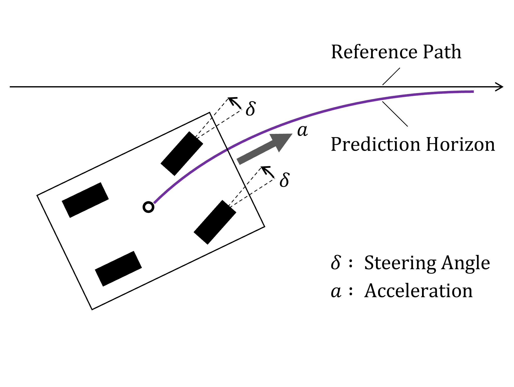

[](https://opensource.org/licenses/MIT)

# Simple MPPI Implementation with Python

A simple Model Predictive Path-Integral (MPPI) controller implementation based on the work by [Mizuho Aoki](https://mizuhoaoki.github.io/). It implements a Python version of MPPI controller introduced by [[G. Williams et al., 2018]](#references) in their 2018 paper.

Note that the ```stage_cost``` and ```terminal_cost``` functions are both a simple quadratic const function. I opted to remove terminal cost.

**TODO** write one two lines regarding the inputs, outputs of the system, talk about compatiblity with ROS based linear body twist command.

## Supported vehicle models

* Ideal Differential Drive --> tested
* Ideal Bicycle model --> Refer to Mizuho's repository.

<!-- TODO add video of Diff drive robot once ready -->
<!-- 


 -->
<!-- https://github.com/MizuhoAOKI/python_simple_mppi/assets/63337525/bda8cdbc-5cfd-4885-ac8d-3240867f027c -->

## Setup

* Clone this repo, create a mamba (or conda enviornment) and install the required dependencies

```bash
mamba create --name ee7500_proj --clone base
mamba activate ee7500_proj
mamba install ipykernel numpy pandas matplotlib seaborn numba
```

## Optional

* [ffmpeg](https://ffmpeg.org/)
  * mp4 movie writer
  * <details>
    <summary>installation details</summary>

    * For Ubuntu Users
      * `sudo apt-get update`
      * `sudo apt-get -y install ffmpeg`
    * For Windows Users
      * Install [scoop](https://scoop.sh/)
      * `scoop install ffmpeg`
    * For macOS Users
      * Install [homebrew](https://brew.sh/)
      * `brew install ffmpeg`
    * Check the official website if necessary
      * https://ffmpeg.org/

    </details>

## Usage

## Path Tracking Examples

* Ackermann car model


* Differential drive model (applicable for 2W, 4W or more configurations)

## Run Experiments

* Run simulation for ackermann drive model (originally from Mizuho)

```sh
cd python_simple_mppi
poetry run python scripts/mppi_pathtracking.py
```

* Run simulation for ackermann drive model with obstacles (originally from Mizuho)

```sh
cd python_simple_mppi
poetry run jupyter notebook notebooks/mppi_pathtracking_obav.ipynb
    ```

## References
1. G. Williams et al. "Information-Theoretic Model Predictive Control: Theory and Applications to Autonomous Driving" 
    * URL : https://ieeexplore.ieee.org/document/8558663
    * PDF : https://arxiv.org/pdf/1707.02342.pdf

## Other notable projects

* mpc_python: https://github.com/mcarfagno/mpc_python
* nav2's MPPI impelemtation: https://vimeo.com/879001391